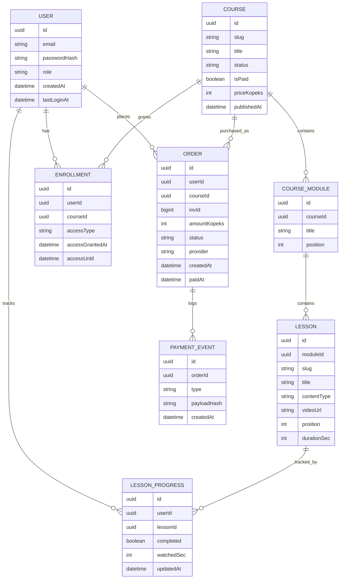
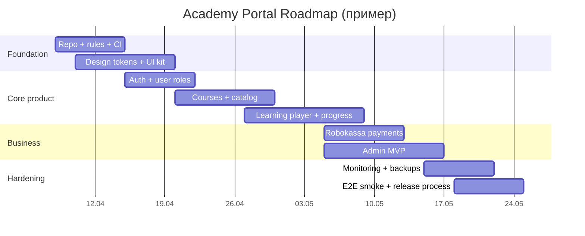

# Создание портала «Академия риэлторов» со ставкой на стабильность кода и человекоподобный дизайн

## Executive summary

Я строю портал как продукт с двумя равновероятными провалами: «сломалось/не дебажится» и «выглядит как случайная верстка ИИ». Поэтому я закладываю в основу не “красивые страницы”, а систему: дизайн‑токены, компонентные правила, модульную архитектуру и рельсы процесса разработки (PR, CI, линтеры, миграции, бэкапы). Это снижает шанс визуального “хаоса” (наслоения, кривые блоки, несостыкованные отступы) и одновременно делает код поддерживаемым. citeturn4search1turn4search4turn3search1turn12view0

Обязательные ограничения, которые я учитываю: коммиты в entity["company","GitHub","code hosting platform"], деплой через entity["company","Railway","deploy platform"] (автодеплой по ветке + конфиг в репозитории), оплата только через entity["company","Robokassa","payment gateway, ru"] (ResultURL/SuccessURL/FailURL + верификация подписи), разработка с entity["company","Cursor","ai code editor"] и Codex от entity["company","OpenAI","ai company"] как “исполнителя по правилам”, а не как генератора “монолитных страниц”. citeturn10view0turn13view1turn22search2turn11view0turn18view1turn21view0

Ключевые решения стека на апрель 2026: Node.js в режиме Active LTS (на этот момент это ветка v24) + современный Next‑стек (App Router), TypeScript 6.x, pnpm 10.x, Postgres (Railway DB), ORM с миграциями (Prisma) и обязательный контур качества: ESLint flat config, Prettier, pre‑commit хуки, CI в GitHub Actions, e2e на Playwright, мониторинг ошибок через entity["company","Sentry","error monitoring platform"]. citeturn24search1turn24search3turn24search2turn15view0turn14view0turn16search2turn16search3turn4search3turn9search3

Я фиксирую «системные файлы правил» прямо в репозитории: PROJECT_RULES.md, DESIGN_SYSTEM.md, COMPONENT_RULES.md, PAGE_BLUEPRINTS.md + AGENTS.md (для Codex) + .cursor/rules/*.mdc (для Cursor). Это превращает стиль и архитектуру в “контракт”, который ИИ обязан соблюдать, а не в “пожелания”. citeturn18view1turn19view2turn21view0turn21view1

## Контекст, допущения и цели качества

**Что я строю (в рамках этого отчёта).** Портал обучения, где я удобно загружаю курсы, пользователи логинятся и проходят уроки, часть курсов бесплатные, часть платные; есть личный кабинет и админка. Это функционально ближе к “микро‑LMS”, но без перегруза корпоративными фичами на старте. citeturn15view0turn13view0turn13view1

**Что не указано (фиксирую как «не указано» и не блокирую работу).**
- Домен/бренд‑гайд/логотип: **не указано**.
- Целевая аудитория (опыт, регион), язык интерфейса (кроме того, что я общаюсь по‑русски): **не указано**.
- Формат курсов (видео, тексты, тесты, задания, PDF): **не указано**.
- Требования к мобильному приложению: **не указано**.
- Юридические требования (оферта, политика обработки данных, 54‑ФЗ/чек‑данные): **не указано** (но платежи через Robokassa подразумевают, что мне всё равно понадобится корректная юридическая обвязка). citeturn13view0turn13view1

**Мои цели качества (то, что я считаю “готово”).**
- **Визуальная консистентность**: в проекте нет “случайных” цветов/отступов/радиусов; всё идет из токенов Tailwind theme variables / design system. citeturn4search1turn4search22
- **Компонентность**: страницы собираются из компонентов; компоненты имеют состояния; нет “монолитных страниц” и “верстки на месте” без дизайн‑системы. citeturn4search0turn4search25
- **Надёжность продакшена**: миграции применяются безопасно через CI/CD (migrate deploy), деплой имеет healthcheck, есть мониторинг и понятная стратегия бэкапов. citeturn14view0turn11view0turn22search3turn11view1
- **Безопасность интеграций**: вебхуки/уведомления платежей валидируются подписью и обрабатываются идемпотентно; все боевые эндпоинты только HTTPS. citeturn13view1turn9search2turn9search9
- **Процесс**: PR‑шаблоны, CODEOWNERS (даже если я один), protected main, обязательные статусы, понятные коммиты (Conventional Commits) и версия по SemVer. citeturn12view0turn12view1turn12view2turn3search2turn3search3

## Рекомендуемый стек и альтернативы сервисов

### Базовый рекомендуемый стек

Я выбираю стек, который минимизирует интеграционные сюрпризы с Railway и хорошо ложится на “модульный frontend + API + Postgres”:

- Runtime: **Node.js v24 Active LTS** (на апрель 2026 это активная LTS‑ветка; odd‑ветки не для продакшена). citeturn24search1turn24search0  
- Package manager: **pnpm** (актуальные версии 10.x; есть собственные бенчмарки и активные релизы). citeturn24search2turn24search10  
- Frontend/Backend: **Next.js App Router** (Server Components / современные возможности). citeturn15view0turn23search5  
- БД: **PostgreSQL на Railway** (переменные подключения PG* и DATABASE_URL доступны сервисам). citeturn22search1turn22search23  
- ORM: **Prisma** (прод‑процедура — migrate deploy; dev — migrate dev). citeturn14view0turn14view1  
- UI: Tailwind CSS v4 + shadcn/ui (компоненты обновлены под Tailwind v4 и React 19). citeturn23search3turn4search25turn4search0turn4search1  
- CI: GitHub Actions (actions/setup-node для установки и кэша зависимостей). citeturn16search0turn16search4turn16search5  
- E2E: Playwright (есть гайд по настройке CI на GitHub Actions). citeturn4search3turn4search6  
- Мониторинг: Sentry для full‑stack Next.js (инструментирует client/server/edge). citeturn9search3turn9search20  
- Платежи: Robokassa “pay interface” + ResultURL/SuccessURL/FailURL + подписи Password#1/#2. citeturn13view0turn13view1  
- Деплой: Railway GitHub autodeploys + railway.toml/railway.json (config‑as‑code, поддержка preDeployCommand и healthcheckPath). citeturn22search2turn11view0turn27view0  

### Таблица сравнения: архитектурный “каркас” приложения

| Вариант | Плюсы | Минусы | Когда я выбираю |
|---|---|---|---|
| Next.js App Router (рекомендую) | Единый репозиторий для UI + API (Route Handlers), удобно деплоить контейнером на Railway, современная архитектура App Router | Нужно дисциплинированно разделять server/client, иначе легко получить “грязные” компоненты | Основа портала: лендинг + кабинет + админка + API вебхуков citeturn15view0turn15view2 |
| Remix (альтернатива) | Чёткая data‑ориентированная модель, хорошие формы | Экосистема/шаблоны под “LMS + админка” для меня менее стандартны (не указано, что я уже опытен в Remix) | Если я сознательно хочу сильнее упор на формы/SSR |
| Разделение на 2 приложения (web + admin) | Жёсткая изоляция админки | Двойная сборка/маршрутизация/сессии, сложнее деплоить и поддерживать | Если админов много/нужна отдельно защищенная поверхность (не указано) |

Опорный факт для Next‑варианта: Route Handlers — это серверные обработчики в app‑директории; они “эквивалентны API Routes” в pages‑директории и не требуют смешивать подходы. citeturn15view2

### Таблица сравнения: Auth + роли (альтернативы)

Поскольку “не указано”, нужна ли мне сложная федерация логинов (SSO) или достаточен email+password, я держу 2 дорожки: **простая (Auth.js + своя БД)** и **SaaS‑auth (Clerk / Supabase Auth / Auth0)**.

| Auth‑вариант | Хранение пользователей | Роли (RBAC) | Плюсы | Минусы | Рекомендация |
|---|---|---|---|---|---|
| Auth.js (ex‑NextAuth) + Postgres | В моей БД | В моей БД | Полный контроль, меньше внешних зависимостей | Я сам отвечаю за UX восстановления/подтверждений | **Рекомендую**, если я хочу максимальную независимость (не указано) |
| Supabase Auth | В Supabase | Роли можно в Supabase/Postgres | Быстрый старт, много готового | Добавляю второй “бэкенд‑вендор” помимо Railway | Хорошо для MVP, если меня устраивает Supabase как второй инфраструктурный слой |
| Clerk/Auth0 | Вендор | Роли частично у вендора + моя БД | Быстрый безопасный auth, хороший UX | Стоимость/вендор‑локин, интеграции меняются | Если критичны enterprise‑фичи (не указано) |

Важное решение именно для архитектуры портала: **роли и доступы к курсам всё равно живут в моей БД**, потому что “покупка/доступ/прогресс” — доменная логика, а не “часть логина”. (Это логический вывод из обязательной модели оплат + прогресса, не привязан к одному источнику.)

### Таблица сравнения: ORM и миграции

| ORM | Миграции | Типобезопасность | Плюсы | Минусы | Что я беру |
|---|---|---|---|---|---|
| Prisma | prisma migrate dev/deploy | Высокая | Чёткие практики: в прод только migrate deploy; в dev migrate dev; есть рекомендации по безопасному деплою миграций | Нужно следить за “опасными” миграциями и блокировками | **Берём в базовый стек** citeturn14view0turn14view1 |
| Drizzle | drizzle kit | Высокая | Лёгкая, SQL‑похожий стиль | Потребует моих собственных дисциплин для прод‑процедур | Альтернатива, если я предпочитаю SQL‑подход (не указано) |
| Kysely | SQL builder | Зависит | Очень “ручной” контроль | Миграции не “встроены” так же явно | Скорее для опытных команд/особых требований |

## Архитектура портала и модульная структура кода

### Модули продукта, которые я фиксирую как “контракт”

Я делю продукт на модули, соответствующие пользовательским сценариям (это помогает и людям, и агентам не лепить мешанину):

- **Landing**: главная, оффер, демо‑отрывки, CTA, FAQ.
- **Auth**: вход/регистрация/восстановление.
- **Каталог**: список курсов, поиск/фильтры, карточки.
- **Страница курса**: описание, программа, цена/доступ, кнопка “начать/купить”.
- **Плеер/проходжение**: уроки, прогресс, заметки/комментарии (если будет).
- **ЛК (ученика)**: мои курсы, прогресс, сертификаты (если будет), платежи/чеки (не указано).
- **Админка**: курсы/уроки/публикации, пользователи, продажи, промо‑коды (если будут), роли.
- **Платежи (Robokassa)**: инициация оплаты, проверка ResultURL, выдача доступа, статусы/повторы. citeturn13view0turn13view1turn15view2

Ключевой принцип: **API интеграций и фоновые процессы — это тоже модули**, а не “кусок кода в page.tsx”. Route Handlers в Next позволяют держать эти поверхности в app‑директории отдельно от UI. citeturn15view2

### Рекомендованный разрез по слоям внутри каждого модуля

Чтобы избежать “монолитных страниц” и “вечных правок в одном файле”, я использую одинаковую структуру в каждом домене:

- **ui/**: только компоненты представления (получают данные через props).
- **server/**: только серверные операции (доступ к БД, транзакции, вызовы Robokassa, проверка подписи).
- **validators/**: схемы валидации входа (например, для форм и вебхуков).
- **types/**: доменные типы.
- **queries/**: читающие запросы (list/get).
- **commands/**: изменяющие операции (create/update/enroll/markComplete).  

Этот подход совпадает с тем, как Codex рекомендует задавать “контекст + ограничения + done‑when” и выносить правила в AGENTS.md вместо повторения в каждом промпте. citeturn18view1turn19view2

### Рекомендуемая структура репозитория и файлов

Я даю структуру, которую можно буквально положить в проект и дальше “не спорить с ней”.

```txt
/
  .cursor/
    rules/
      00-master.mdc
      01-design-system.mdc
      02-components.mdc
      03-api-payments.mdc
  .github/
    PULL_REQUEST_TEMPLATE.md
    CODEOWNERS
    workflows/
      ci.yml
  .husky/
    pre-commit
    commit-msg
  prisma/
    schema.prisma
    migrations/
  scripts/
    backup-db.sh
    validate-commit-message.mjs
  src/
    app/
      (public)/
        page.tsx
        layout.tsx
      (auth)/
        login/page.tsx
        register/page.tsx
      (app)/
        courses/page.tsx
        courses/[courseSlug]/page.tsx
        learn/[courseSlug]/[lessonSlug]/page.tsx
        dashboard/page.tsx
      admin/
        page.tsx
        courses/
        users/
        sales/
      api/
        health/route.ts
        robokassa/
          result/route.ts
          success/route.ts
          fail/route.ts
    modules/
      auth/
        ui/
        server/
        validators/
        types.ts
      courses/
        ui/
        server/
        validators/
        types.ts
      billing/
        ui/
        server/
        validators/
        types.ts
      progress/
        ui/
        server/
      admin/
        ui/
        server/
    components/
      ui/           # shadcn/ui + мои обёртки
      layout/       # Container, Stack, Grid, PageHeader
      branding/     # Logo, BrandMark
    styles/
      globals.css
      theme.css
    lib/
      db.ts
      env.ts
      logger.ts
      security.ts
  AGENTS.md
  PROJECT_RULES.md
  DESIGN_SYSTEM.md
  COMPONENT_RULES.md
  PAGE_BLUEPRINTS.md
  railway.toml
  eslint.config.mjs
  prettier.config.mjs
  package.json
```

Почему так: Railway поддерживает config‑as‑code (railway.toml или railway.json) и имеет понятные механики healthchecks и pre‑deploy команды, поэтому инфраструктурные “контракты” я тоже держу рядом с кодом. citeturn11view0turn27view0turn22search3

## Дизайн-система, UI-компоненты и правила проектирования

### Как я делаю дизайн “человеческим”, а не “ИИ‑случайным”

Проблема, которую я описал (“вертикальные блоки вместо горизонтальных”, “анимации кривые”, “наслоения”), почти всегда возникает, когда нет:
1) сетки/контейнеров,  
2) токенов отступов/цветов,  
3) библиотечных компонентных примитивов (Button/Input/Modal) со всеми состояниями,  
4) правил “нельзя делать X”. citeturn4search1turn4search4turn4search25

Я решаю это так:
- **Единая сетка**: max‑width контейнера + предсказуемые брейкпоинты; все страницы строятся из Container + Grid + Stack (компоненты‑примитивы для раскладки).  
- **Только токены**: отступы/радиусы/цвета/тени — только из DESIGN_SYSTEM, без “случайных” значений. Tailwind прямо называет эти низкоуровневые решения “design tokens” и предлагает хранить их как theme variables. citeturn4search1  
- **Доступность как маркер “человеческой” работы**: видимый focus и корректные модалки. Это легко отличает ручной дизайн от “случайной верстки”. citeturn9search0turn9search1turn9search7
- **Иллюстрации/иконки**: одна библиотека иконок (одна толщина линии), иллюстрации — либо брендовые (лучше), либо один выбранный стиль (плоские/линейные), без “смешивания” в разных стилях (не указано, какой бренд‑стиль нужен — значит фиксирую один стиль в DESIGN_SYSTEM).  

image_group{"layout":"carousel","aspect_ratio":"16:9","query":["modern online course dashboard UI clean design","learning management system course catalog UI","admin panel clean design cards table"],"num_per_query":1}

### Набор обязательных UI‑компонентов и их состояния

Я фиксирую минимальный набор (без которого портал неизбежно расползётся визуально). Это “обязательные примитивы”, и я запрещаю писать UI минуя их.

| Компонент | Варианты | Состояния (минимум) | Комментарий |
|---|---|---|---|
| Button | primary / secondary / ghost / destructive / link | default, hover, active, focus-visible, disabled, loading | Focus‑индикатор обязателен (видимый). citeturn9search0 |
| Input/Textarea | default / withIcon | default, focus, disabled, error, success | Ошибка — через FormField (единый паттерн). |
| Select/Combobox | default | closed/open, focus, disabled, error | Для фильтров каталога. |
| Checkbox/Switch | default | checked/unchecked, focus, disabled | Доступность. |
| Modal/Dialog | sizes sm/md/lg | open/close, focus trap | Модалка должна удерживать tab‑фокус. citeturn9search1 |
| Toast/Notification | info/success/error | show/hide | Для “оплата принята/ошибка”. |
| Card | default/outlined | — | База для каталога/панелей. |
| Tabs | underline/pills | active/inactive, focus | Для страницы курса/админки. |
| Table | default | loading/empty/error | Продажи/пользователи в админке. |
| Pagination | default | disabled edges | Каталог. |
| Badge/Tag | neutral/accent | — | Статусы “бесплатно/платно/в процессе”. |
| Progress | bar/ring | 0–100% | Прогресс курса. |
| Skeleton | — | — | Загрузка. |
| VideoPlayerShell | — | loading/playing/paused/error | Реальный плеер может быть внешним, но “обвязка” единая. |
| CourseCard (domain) | бесплатный/платный | locked/unlocked/in-progress/completed | Доменные состояния важнее цвета. |

Основа для такого набора — shadcn/ui, который позиционируется как набор воспроизводимых компонентов, основанных на Tailwind; и отдельно отмечает поддержку Tailwind v4 и обновления компонентов под актуальный стек. citeturn4search0turn4search25turn4search17

### UX‑правила токенов: типографика, сетка, отступы, радиусы, цвета, motion

Я фиксирую эти правила в DESIGN_SYSTEM.md и в tailwind/theme файле. Важно: Tailwind прямо предполагает хранить токены в theme variables (как интерфейс к дизайн‑решениям). citeturn4search1turn4search22

**Рекомендуемый минимум токенов (пример для проекта):**
- **Типографика**: один основной шрифт для UI + один акцентный (не указано, есть ли фирменный шрифт → значит выбираю нейтральные).  
  - UI: `Manrope` (или `Inter`, если я хочу максимально “стандартно”, но тогда я компенсирую характером через композицию).  
  - Заголовки: тот же, но с другими weight/letter‑spacing (не второй шрифт, если хочу проще).  
- **Сетка**: max‑width 1120–1200px, 12 колонок, gutter 24px (на md+), на mobile — 4 колонки/stack.  
- **Отступы**: шкала 4px (4/8/12/16/24/32/48/64). Tailwind позволяет кастомизировать spacing scale через theme. citeturn4search4  
- **Радиусы**: 10px базовый, 14px карточки, 999px pill.  
- **Цвета**: нейтраль + один brand accent + semantic (success/warn/danger).  
- **Motion**: 150ms (micro), 250ms (panel), easing `ease-out`; анимаций мало, но они смысловые (не “вечное прыг‑скок”).  

**Accessibility‑правила (обязательные):**
- Я обеспечиваю видимый фокус для клавиатурной навигации. citeturn9search0  
- Модалки должны удерживать tab‑фокус и не выпускать его наружу, пока окно открыто. citeturn9search1  
- Контраст и focus‑appearance я проверяю (минимум на основных UI). citeturn9search4turn9search7  

### Системные файлы правил, которые я кладу в репозиторий

Ниже — содержимое обязательных файлов, которые я использую как “источник истины”. Они одновременно полезны людям и подхватываются агентами через AGENTS.md/.cursor rules (см. следующий раздел про мастер‑промпты). citeturn18view1turn19view2turn21view0

```md
# PROJECT_RULES.md

## Цель
Я строю портал "Академия риэлторов" как модульную систему обучения (LMS-lite).
Главные приоритеты: стабильность, чистота кода, дизайн-консистентность.

## Технологический контракт
- Runtime: Node.js Active LTS (>= 24)
- TypeScript: strict: true
- Package manager: pnpm (только pnpm, без npm/yarn lockfiles)
- DB: PostgreSQL
- ORM: Prisma (prod: migrate deploy; dev: migrate dev)
- Deploy: Railway (github autodeploy + railway.toml / railway.json)
- Payments: Robokassa (ResultURL + подпись + OK{InvId})
- Тесты: unit + e2e (Playwright)
- Линт/формат: ESLint flat config + Prettier

## Репозиторий и архитектура
- Никаких монолитных page.tsx > 200 строк.
- UI только через дизайн-систему.
- Все domain-операции через modules/*/server (никакой DB логики в компонентах UI).
- Каждый модуль: ui / server / validators / types.
- Любая интеграция (платежи, webhooks) оформляется как модуль billing.

## Done means
- Сборка проходит.
- Линт и формат проходят.
- Тесты проходят (или явно зафиксировано что не указано/нет тестов и почему).
- UI не вводит новые цвета/отступы/радиусы вне DESIGN_SYSTEM.md.
```

```md
# DESIGN_SYSTEM.md

## Принцип
Я НЕ придумываю новые цвета/отступы/радиусы на лету.
Я использую только токены, описанные здесь.

## Layout tokens
- container.maxWidth: 1200px
- grid.columns: 12 (desktop), 4 (mobile)
- gutter: 24px (desktop), 16px (mobile)
- spacing scale (px): 4, 8, 12, 16, 24, 32, 48, 64

## Radius tokens
- radius.sm: 8px
- radius.md: 10px
- radius.lg: 14px
- radius.full: 999px

## Typography
- font.ui: "Manrope", system-ui, sans-serif
- font.mono: "ui-monospace", "SFMono-Regular", "Menlo", monospace
- type scale (rem): 0.875, 1.0, 1.125, 1.25, 1.5, 2.0

## Colors (пример)
- neutral: 0/50/100/200/300/400/500/600/700/800/900
- brand: 500/600/700
- success/warn/danger: 600

## Component states
- Все интерактивные элементы: focus-visible обязателен.
- Button primary:
  - default: brand600 bg, white text
  - hover: brand700
  - active: brand700 + slight inset
  - disabled: neutral200 bg + neutral400 text
  - loading: spinner + disabled
- Form field error:
  - border: danger600
  - helper text: danger600
```

```md
# COMPONENT_RULES.md

## Общие правила
- Компоненты маленькие и переиспользуемые.
- Никаких inline-стилей и "случайных" классов.
- Использовать только:
  - design tokens (через Tailwind theme variables)
  - готовые UI-примитивы (Button/Input/Dialog/...)
- Запрещено:
  - добавлять новые hex-цвета
  - использовать произвольные значения отступов (типа p-[13px])
  - позиционировать layout через absolute (кроме иконок/декора)

## Структура компонента
- Props типизированы.
- Варианты через единый механизм (например, cva), а не через if-else по всему JSX.
- Состояния обязаны быть явно поддержаны: loading/disabled/error.

## Тестируемость
- Критические компоненты: data-testid для e2e.
- Модалки и формы: проверка фокуса и навигации клавиатурой.
```

```md
# PAGE_BLUEPRINTS.md

## Landing (/)
Секции:
- Hero (value proposition)
- Преимущества (3-6 карточек)
- Витрина курсов (3-6)
- Отзывы/кейсы (не указано)
- FAQ
- Footer

## Auth (/login, /register)
- Card-centered layout
- Email/password + forgot
- Ошибки форм унифицированы

## Каталог (/courses)
- Поиск
- Фильтры
- Сетка карточек
- Пагинация

## Страница курса (/courses/[slug])
- Обложка + краткое описание
- Программа (модули/уроки)
- Цена/кнопка: купить/начать
- Блок "что внутри" (если есть)

## Плеер (/learn/[courseSlug]/[lessonSlug])
- Left: lesson content/player
- Right: навигация по урокам + прогресс
- Bottom: Next/Prev, mark complete

## ЛК (/dashboard)
- Мои курсы
- Прогресс
- Платежи/доступы (минимум)

## Админка (/admin)
- Курсы CRUD
- Уроки CRUD
- Пользователи (роль, доступ)
- Продажи/заказы
```

## Процессы разработки и эксплуатация

### Правила для Cursor + Codex как “системная инструкция”

**Почему это важно именно сейчас (апрель 2026).** Codex‑подход упирается в “длительные сессии” и устойчивое следование инструкциям; OpenAI прямо пишет, что ключевой практический сдвиг — рост “time horizon” и способность агента выполнять цикл plan → implement → validate → repair. citeturn10view1turn10view2

**AGENTS.md (для Codex).** OpenAI рекомендует выносить повторяемые правила в AGENTS.md и описывает, что Codex автоматически подхватывает такие файлы и “closely adhere” к ним; также поддерживается иерархия (глобальный, repo‑уровень, подпапки). citeturn18view1turn19view2

**.cursor/rules/*.mdc (для Cursor).** В экосистеме Cursor `.cursorrules` считается legacy и планируется к деприкации; рекомендованная форма — `.cursor/rules/*.mdc` с frontmatter. citeturn21view0

Ниже я даю мастер‑инструкцию, которую реально кладу в репозиторий.

```md
# AGENTS.md — MASTER PROMPT (repo-level)

Ты — кодовый агент. Ты обязан следовать PROJECT_RULES.md, DESIGN_SYSTEM.md,
COMPONENT_RULES.md, PAGE_BLUEPRINTS.md.

## Абсолютные запреты
- НЕ генерируй монолитные страницы. Любая страница >200 строк — это ошибка.
- НЕ придумывай новые цвета/отступы/радиусы/анимации. Только токены дизайн-системы.
- НЕ используй inline styles. Не добавляй случайные hex/px значения.
- НЕ смешивай DB/платежную логику в UI-компоненты.
- НЕ меняй стратегию (стек/архитектуру) без явной причины.

## Обязательный стиль работы
- Всегда начинай с: "Goal / Context / Constraints / Done when" (внутренне для себя).
- Любое изменение — через маленькие компоненты и модули.
- Любая форма/кнопка/модалка — через готовые UI primitives.
- После правок: типы, линт, тесты (или явно отметить, что тестов нет/не указано).

## UI правила
- Использовать только дизайн-токены.
- Использовать layout primitives: Container, Stack, Grid.
- Состояния компонентов обязательны: hover/active/focus/disabled/loading/error.
- Доступность: focus-visible обязателен; модалки держат фокус.

## Payments (Robokassa)
- ResultURL обработчик обязан:
  1) сверить подпись по параметрам Robokassa
  2) быть идемпотентным (повторный вызов не ломает данные)
  3) отвечать "OK{InvId}" при успехе
- Никаких обновлений заказа до проверки подписи.

## Структура проекта
- Любой новый функционал кладётся в src/modules/<domain>/
- UI: src/modules/<domain>/ui/*
- Server: src/modules/<domain>/server/*
- Validators: src/modules/<domain>/validators/*
```

И Cursor‑специфичный вариант (чтобы правило “всегда применялось” именно в Cursor):

```md
---
description: Master rule — always apply
globs:
alwaysApply: true
---

Всегда соблюдай файлы:
- PROJECT_RULES.md
- DESIGN_SYSTEM.md
- COMPONENT_RULES.md
- PAGE_BLUEPRINTS.md

Запрещено: монолитные страницы, новые токены, inline styles.
```

Смысл этих файлов — сделать так, чтобы агент был “исполнителем по контракту”, что совпадает с практикой OpenAI: переносить устойчивые правила в AGENTS.md, а не повторять их в каждом запросе. citeturn18view1turn19view2turn10view0

### Git‑процесс: ветвление, коммиты, PR, релизы, ревью

**Ветвление.** Для портала (особенно если я один или маленькая команда) я рекомендую trunk‑based: `main` защищён, работа идёт в коротких feature‑ветках, всё вливается через PR. Это прямо ложится на protected branches и required status checks. citeturn12view2turn12view3

**Коммиты.** Я использую Conventional Commits как формат истории и как основу для автогенерации changelog/версий. Спецификация задаёт формат `<type>[scope]: <description>`. citeturn3search2  
Политику версий я строю на SemVer (Major.Minor.Patch), где изменение версии “несёт смысл”. citeturn3search3

Примеры коммитов:
- `feat(courses): add course catalog filters`
- `fix(billing): make robokassa result handler idempotent`
- `chore(ci): add playwright e2e job`
- `refactor(ui): extract CourseCard component`
- `docs: update DESIGN_SYSTEM tokens`

**PR‑шаблоны и CODEOWNERS.** GitHub поддерживает PR templates и CODEOWNERS для стандартизации ревью и назначения ответственных. citeturn12view0turn12view1

Пример `.github/PULL_REQUEST_TEMPLATE.md`:

```md
## Что сделано
Коротко: ...

## Почему
Ссылка на issue/задачу: ...

## Скриншоты (если UI)
- [ ] приложил(а) скриншоты до/после

## Проверка
- [ ] pnpm lint
- [ ] pnpm typecheck
- [ ] pnpm test
- [ ] pnpm e2e (если затронут критический флоу)

## Риски
- Миграции: [ ] нет / [ ] да (описать)
- Платежи: [ ] не затронуто / [ ] затронуто (описать)

## Checklist
- [ ] не добавлял(а) новые токены (цвета/отступы)
- [ ] не создал(а) монолитные pages
- [ ] обработаны состояния disabled/loading/error
```

Пример `.github/CODEOWNERS` (даже если я один — это дисциплина):

```txt
# default
* @my-github-username

# payments are sensitive
/src/modules/billing/ @my-github-username
/src/app/api/robokassa/ @my-github-username
/prisma/ @my-github-username
```

### CI/CD: проверка, деплой, миграции, откаты

**CI в GitHub Actions.** Я использую workflow syntax и concurrency, чтобы PR‑проверки не плодились бесконечно. GitHub описывает `concurrency` как механизм, который гарантирует, что в группе одновременно работает только один job/workflow. citeturn16search1turn16search5

**Node установка и кэш.** `actions/setup-node` умеет ставить Node и кэшировать зависимости npm/yarn/pnpm. citeturn16search0turn16search4

Пример `.github/workflows/ci.yml` (адаптирован под ESLint flat config, без next lint, потому что начиная с Next.js 16 `next lint` удалён). citeturn16search2turn16search30

```yaml
name: CI

on:
  pull_request:
  push:
    branches: [main]

concurrency:
  group: ci-${{ github.ref }}
  cancel-in-progress: true

jobs:
  test:
    runs-on: ubuntu-latest
    steps:
      - uses: actions/checkout@v4

      - uses: actions/setup-node@v4
        with:
          node-version: "24"
          cache: "pnpm"

      - name: Enable corepack
        run: corepack enable

      - name: Install deps
        run: pnpm install --frozen-lockfile

      - name: Lint
        run: pnpm eslint .

      - name: Typecheck
        run: pnpm typecheck

      - name: Unit tests
        run: pnpm test

  e2e:
    runs-on: ubuntu-latest
    needs: [test]
    steps:
      - uses: actions/checkout@v4

      - uses: actions/setup-node@v4
        with:
          node-version: "24"
          cache: "pnpm"

      - name: Enable corepack
        run: corepack enable

      - name: Install deps
        run: pnpm install --frozen-lockfile

      - name: Install Playwright browsers
        run: pnpm exec playwright install --with-deps

      - name: Run Playwright
        run: pnpm e2e
```

Playwright прямо даёт руководство по настройке CI на GitHub Actions и загрузке отчётов/трейсов. citeturn4search3turn4search6

**CD на Railway.** Railway умеет GitHub autodeploy: сервисы, привязанные к репозиторию, автоматически деплоятся при новых коммитах в выбранную ветку. citeturn22search2

**railway.toml/railway.json.** Railway поддерживает “config as code” и по умолчанию ищет railway.toml или railway.json; конфиг из кода переопределяет dashboard настройки для конкретного деплоя. citeturn11view0turn26view0turn27view0

Пример `railway.toml` (с pre‑deploy миграциями и healthcheck):

```toml
[build]
builder = "RAILPACK"
buildCommand = "pnpm install --frozen-lockfile && pnpm build"

[deploy]
startCommand = "pnpm start"
preDeployCommand = "pnpm prisma migrate deploy"
healthcheckPath = "/api/health"
healthcheckTimeout = 60
restartPolicyType = "ON_FAILURE"

[environments.production.deploy]
numReplicas = 1
```

Ключевые поля (`deploy.startCommand`, `deploy.preDeployCommand`, `deploy.healthcheckPath`) подтверждаются актуальной Railway JSON schema (она же может быть использована редактором для автокомплита). citeturn27view0turn11view0

**Миграции БД.** Prisma рекомендует: в продакшене применять только `prisma migrate deploy` с закоммиченными миграциями; `migrate dev` и `db push` в проде не использовать. citeturn14view0turn14view1

### Линтеры/форматтеры и pre-commit хуки

**ESLint (flat config).** ESLint v9 делает flat config форматом по умолчанию; migration guide описывает `eslint.config.js`. citeturn16search2turn16search6  
**Prettier.** Prettier подчёркивает, что не поддерживает глобальный конфиг, чтобы поведение было одинаковым в команде; конфиги задаются в репозитории. citeturn16search35turn16search3  
**Husky + lint-staged.** Husky документирует примеры хуков; lint-staged предназначен для запуска задач только на staged файлах. citeturn4search11turn4search15

Пример `eslint.config.mjs` (минимальный каркас):

```js
import js from "@eslint/js";

export default [
  js.configs.recommended,
  {
    files: ["src/**/*.{ts,tsx}"],
    languageOptions: {
      ecmaVersion: "latest",
      sourceType: "module",
    },
    rules: {
      "no-unused-vars": "off",
    },
  },
];
```

Пример `prettier.config.mjs`:

```js
/** @type {import("prettier").Config} */
export default {
  semi: true,
  singleQuote: true,
  trailingComma: "all",
  printWidth: 100,
};
```

Про `printWidth` Prettier отдельно отмечает, что это “не жёсткий лимит”, а целевая длина строк. citeturn16search3

Пример husky:

```sh
# .husky/pre-commit
pnpm lint-staged
```

```sh
# .husky/commit-msg
node scripts/validate-commit-message.mjs "$1"
```

Пример `lint-staged` в `package.json`:

```json
{
  "lint-staged": {
    "src/**/*.{ts,tsx,js,jsx,json,css,md}": [
      "prettier --write",
      "eslint --fix"
    ]
  }
}
```

### Платежи Robokassa: модуль billing и безопасность обработки

**Сборка подписи и обязательные параметры (инициация оплаты).** В “Интерфейсе оплаты” Robokassa перечисляет параметры MerchantLogin, OutSum и SignatureValue; подпись строится из строки по шаблону (включая Password#1). citeturn13view0

**Уведомление об оплате (ResultURL).** Robokassa прямо требует:
- скрипт на ResultURL проверяет подпись по данным, пришедшим от Robokassa,
- при совпадении должен ответить `OK{InvId}`,
- база для подписи: `OutSum:InvId:Пароль#2` (плюс Shp_* при наличии). citeturn13view1

Отсюда мой “железный” дизайн модуля billing:
- **Команда `createPayment`**: создает Order (статус `pending`), генерирует InvId, формирует ссылку (или форму) на оплату.
- **Webhook/ResultURL handler**:
  1) парсит вход (OutSum, InvId, SignatureValue, Shp_*),  
  2) вычисляет подпись по Password#2,  
  3) сравнивает (тайминг‑safe сравнение — желательно),  
  4) в транзакции переводит Order в `paid` и создаёт Enrollment/доступ,  
  5) отвечает `OK{InvId}`.  

Принимаю, что Robokassa может повторять уведомления (из практики платежных систем), поэтому делаю handler **идемпотентным**: повторный вызов с тем же InvId ничего “не ломает”. (Это следует из необходимости “не зависеть от одного удачного запроса” и общего подхода безопасности вебхуков.) citeturn13view1turn9search9

**Безопасность транспорта.** Для всех “сервер‑сервер” интеграций я использую только HTTPS (OWASP прямо пишет, что secure REST services must only provide HTTPS endpoints). citeturn9search2

### Мониторинг, бэкап, миграции данных, политика версий

**Monitoring.** Sentry предлагает “one install covers client, server, edge” для Next.js и отдельные материалы по запуску. citeturn9search3turn9search20  
В Railway я дополнительно использую:
- healthcheck path (чтобы не отдавать трафик до готовности),
- метрики/логи в dashboard (база наблюдаемости). citeturn22search3turn11view0

**Бэкапы.**
- Railway поддерживает бэкапы томов (restore через Backups tab; есть staging изменений и redeploy). citeturn11view1  
- Для БД я дополнительно закладываю “логический бэкап” (pg_dump) по расписанию — через Railway Cron Jobs или внешний scheduler. Railway описывает настройку Cron Schedule в сервисе. citeturn22search0turn22search1  

**Миграции данных (если у меня уже были попытки/данные в других системах).** Поскольку “не указано”, где сейчас хранятся курсы, моя стратегия:
- Я фиксирую **канонический формат экспорта** (JSON + файлы медиа в S3‑подобном хранилище или Railway bucket — не указано).
- Пишу импорт‑скрипт, который:
  1) валидирует схему,
  2) мапит сущности в текущую ER‑модель,
  3) пишет в БД транзакциями,
  4) логирует реестр импортированных объектов (для повторного запуска).  
Это снижает риск “ручных переносов” и помогает, если структура курсов в будущем изменится (тогда я пишу миграцию данных как отдельный командный script).

**Политика версий.**  
- Для продукта я использую SemVer, чтобы version bump отражал ломающее/совместимое изменение. citeturn3search3  
- До “1.0.0” я считаю API продукта нестабильным (это практическая интерпретация SemVer, если “public API” ещё формируется).  

### ER‑диаграмма БД (Mermaid)

Ниже — базовая ER‑схема (минимум для LMS + оплаты). Поля можно расширять, но “скелет” я держу стабильным.



### MVP scope и roadmap с оценкой трудозатрат

Я считаю MVP таким, чтобы он уже приносил пользу (первый платный курс можно продать), но не превращался в бесконечную LMS.

**MVP (обязательное)**
- Landing + каталог + страница курса.
- Auth (email/password или другой — не указано; выбираю простейший для MVP).
- Проходжение уроков + прогресс “completed/watched”.
- Admin: CRUD курсов/уроков (минимум), публикация.
- Robokassa: купить курс → ResultURL → выдать доступ → success page.
- Базовый CI, линт/формат, миграции, healthcheck. citeturn13view1turn14view1turn22search2turn11view0turn15view2

**Оценка (диапазон, потому что “не указано” про формат контента/сложность уроков):**

| Этап | Содержимое | Приоритет | Оценка |
|---|---|---|---|
| Foundation | репо, токены, UI‑примитивы, правила, CI | P0 | 24–40 часов |
| Auth + Users | модели пользователей/ролей, базовый login | P0 | 16–32 часа |
| Courses core | ER‑ядро курсов/уроков, каталог, страница курса | P0 | 40–70 часов |
| Learning | плеер‑обвязка, прогресс, навигация уроков | P0 | 40–80 часов |
| Admin MVP | CRUD, загрузка контента (минимум), публикация | P0 | 40–80 часов |
| Billing Robokassa | create order, подписи, ResultURL идемпотентность | P0 | 24–50 часов citeturn13view0turn13view1 |
| Hardening | мониторинг, бэкапы, e2e smoke, release checklist | P1 | 24–60 часов citeturn11view1turn4search3turn9search3 |

### Timeline релизов (Mermaid Gantt)



### Чек‑лист релиза

- [ ] Все переменные окружения заданы в Railway (секреты не в git); Next.js напоминает, что .env файлы почти никогда нельзя коммитить. citeturn15view1turn22search23  
- [ ] Railway autodeploy привязан к нужной ветке (prod → main). citeturn22search2  
- [ ] HealthcheckPath настроен и реально возвращает 200 после старта (иначе возможны “полу‑живые” деплои). citeturn22search3turn11view0  
- [ ] Prisma migrate deploy выполняется на деплое (и миграции закоммичены). citeturn14view0turn14view1  
- [ ] Robokassa ResultURL валидирует подпись и отвечает OK{InvId}. citeturn13view1  
- [ ] Включены required status checks + protected main. citeturn12view2turn12view3  
- [ ] Sentry подключён и принимает события. citeturn9search3turn9search20  
- [ ] Бэкапы настроены (Railway volume backups и/или scheduled logical backup). citeturn11view1turn22search0  

### Чек‑лист админки (минимальный)

- [ ] RBAC: доступ к /admin только role=admin (не через “скрытую ссылку”).  
- [ ] CRUD курсов/уроков: валидация входных данных + понятные ошибки форм.  
- [ ] Предпросмотр “как видит ученик” (минимум) — чтобы не публиковать “пустые уроки”.  
- [ ] Технический лог событий оплат (PAYMENT_EVENT), чтобы разбирать спорные случаи.  
- [ ] Экспорт продаж/заказов в CSV (не указано, нужно ли — но для операционки часто критично).  
- [ ] Аудит: кто поменял цену/доступ (не указано; можно отложить как P1).  

Если я буду идти строго по этим правилам, я получаю главный эффект: любые новые страницы и фичи “встраиваются” в существующую систему вместо того, чтобы каждый раз заново порождать хаос. А Cursor/Codex становятся не генераторами мусора, а инструментом ускорения в рамках моего контракта (AGENTS.md + .cursor/rules). citeturn18view1turn21view0turn20view0turn10view2